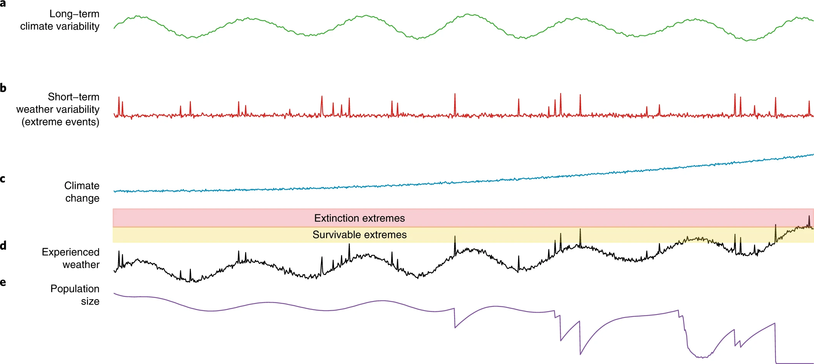
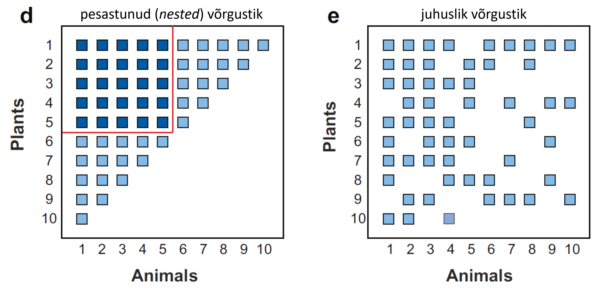

Koosluse stabiilsus kirjeldab koosluse või toiduahela toimetulekut häiringute valguses. Stabiilsus (või mittestabiilsus) avaldub koosluse vastusena häiringule.

Häiringuid võib jagada kaheks:

-   *press* - pikaajaline püsiv kindlasuunaline muutus mingites (näiteks keskkonna-) faktorites. Viib tihtipeale püsivate muutusteni. Näitekl kliima soojenemine, eutrofeerumine, linnastumine, metsaraie, mereveetaseme tõus.

-   *pulse* - lühiajaline, kindlapiiriline sündmus, mis ökosüsteemi mõjutab. Mõju võib olla ajutine või püsiv (oleneb stabiilsusest). Näiteks maastikupõlengud, tormid, üleujutused, kahjurirünnakud.

*Press* ja *pulse* toimivad tihtipeale koosmõjus - vastus *pulse* häiringule sõltub *press*-i tasemest. Organismid on tegelikult üldiselt kohanenud nii *press* (paneel a järgneval joonisel) kui *pulse* (b) häiringutega, samuti soodustavad *pulse* häiringud keskkonna heterogeensuse soodustamise kaudu kooseksisteerimist ja seega mitmekesisust.

Koosmõju ilmestab hästi kliimamuutus (c): pikaajalised kliimatrendid tähendavad *press* fooni tõusu. Kui sellele foonile lisada veel *pulse*-häiringud, võivad keskkonnatasemed ületada populatsioonide ellujäämisläve (d) ning põhjustada lokaalseid väljasuremisi (e).

[{width="100%"}](https://doi.org/10.1038/s41558-018-0187-9)

## Stabiilsuse mõõdikud

-   **Vastupanuvõime** (*resistance*) näitab, mil määral kooslus häiringule reageerib. Kui vastupanuvõime on maksimaalne, ei mõjuta häiring kooslust või koosluse/toiduvõrgustiku funktsiooni üldse.

-   **Säilenõtkus** (*resilience*) näitab, kui kiiresti kooslus häiringu poolt põhjustatud muutusest taastub.

-   **Robustsus** (*robustness*) näitab koosluse vastupanuvõimet lokaalsetele väljasuremistele - kui suur osa koosluse liikidest võib välja surra enne süsteemi täielikku kollabeerumist.

## Võrgustiku struktuur

Koosluse stabiilsus sõltub lisaks häiringute tüübile (*press* vs *pulse*) ka interaktsioonivõrgustike struktuurist. Peaasjalikult tuuakse stabiilsust suurendavate võrgustikutopoloogiliste näitajatena välja interaktsioonivõrgustiku (so troofilised, konkurentsed, mutualistlikud ja fasilitatiivsed interaktsioonid) **pesastumist** (*nestedness*) ja **modulaarsust** (*modularity*).

**Pesastunud** võrgustiku puhul interakteeruvad spetsialistid liikidega, kellega interakteeruvad ka sama taseme generalistid. Säärane ülekate tekitab interaktsioonide puhvri - kui spetsialist või tema interaktsioonipartner peaks süsteemist kaduma, säilitavad generalistide poolt peetavad interaktsioonid süsteemi funktsiooni. Pesastumine tagab seega nii süsteemi *robustsuse* (st vastupanuvõime lokaalsetele väljasuremistele) kui ka liigirikkuse, võimaldades spetsialiseerunud liikidel generalistide poolt ülalpeetavatel interaktsioonidel "liugu lasta".

[{width="100%"}](https://doi.org/10.1146/annurev.ecolsys.38.091206.095818)

**Modulaarsus** tähendab, et võrgustik on jaotatav alaühikuteks - mooduliteks -, millesiseselt liigid üksteisega suhteliselt tugevamalt interakteeruvad, samas kui teiste moodulitega interaktsioonid puuduvad või on nõrgad. Modulaarsus esineb tihemini maismaaökosüsteemides (meenutagem liigi vs koosluse tasemel troofiliste kaskaadide esinemist). Modulaarsus takistab häiringu mõju levimist üle terve süsteemi.

**Joonistame ideaalselt modulaarse taimede ja tolmeldajate interaktsioonivõrgustiku**

```{r}
#| code-fold: true
#| code-summary: "Näita koodi"

suppressWarnings(suppressPackageStartupMessages(library(bipartite)))

# Liikide arvud
n <- 3
madal <- 22 * n
korge <- 44 * n

# Tühi maatriks
mat <- matrix(NA, nrow = madal, ncol = korge)

# Loome moodulid
set.seed(123)
moodulid <- list(
  moodul1 = list(rows = 1:(madal/3), cols = 1:(korge/3)),
  moodul2 = list(rows = (madal/3+1):(madal/3*2), cols = (korge/3+1):(korge/3*2)),
  moodul3 = list(rows = (madal/3*2+1):madal, cols = (korge/3*2+1):korge)
)

# Moodulisisene kõrge interaktsioonisagedus
for (mod in moodulid) {
  mat[mod$rows, mod$cols] <- abs(rnorm(length(mod$rows)*length(mod$cols),
                                       mean = 0.7, sd = 0.2))
}

# Moodulitevaheline harv interaktsioon
mat[is.na(mat)] <- sample(c(0, abs(rnorm(1, mean = 0.2, sd = 0.1))),
                          size = sum(is.na(mat)),
                          replace = TRUE,
                          prob = c(0.8, 0.2))


# Arvutame modulaarsuse
modularity <- computeModules(mat)

# Joonistame
plotModuleWeb(modularity)
```

Kujutagem ette, et read on koosluse taimeliigid ja tulbad on koosluse putuktolmeldajad. Värvi tugevus näitab interaktsioonide tugevust (näiteks ühe taimeliigi õite külastamise sagedus seda liiki tolmeldajate poolt). Kui peaksid kaduma taimeliigid 2-18, on tõenäoline, et kooslusest surevad lokaalselt välja ka putukaliigid 1-43, aga mõju on tõenäolisemalt lokaliseeritud esimeses moodulis - informatsioon (võrgustikuteooria mõttes) ei levi teistesse moodulitesse.
